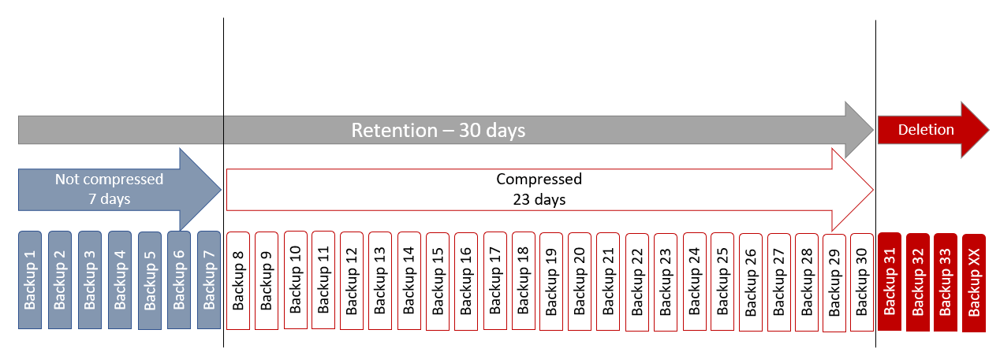

# PostgreSQL Scripts

## pg-backup.sh
This script creates a full PostgreSQL database backup

### Features
- Performing a logical backup of all databases within the PostgreSQL instance
- Generating logs and includes error handling
- Can be scheduled for daily execution
- Included a backup retention mechanism and is deleting backups after a define time automatically
- It compresses backups to save storage. Compressions algorithm can be Gzip or Zstandard

### Requirements
- The script **pg-backup.sh** should be placed for security reasons with 700 permissions to the home-directory of the user, for example: /home/postgres
- The file **pg-backup.conf** should be placed for security reasons with 600 permissions to the home-directory of the user, for example: /home/postgres
- The **.pgpass** should be placed for security reasons with 600 permissions to the home-directory
   - In order to authenticate pg_dumpall against to the database the file .pgpass with a username and password must be available.
- It is best practise to create a dedicated db user which is caring about the backup and not use the default super user "postgres". Here I created user "backup".
  - ROLE pg_read_all_data which is available at PG version >= 14 can be used to restrict access
  - Restore operation would be done with a superuse then
```
SQL> CREATE USER backup WITH ENCRYPTED PASSWORD '<password>'; 
SQL> GRANT pg_read_all_data to backup;
```
```
$ cat /home/postgres/.pgpass
*:*:*:backup:MYPASSWORD
```
- More information can be read here: https://www.postgresql.org/docs/current/libpq-pgpass.html.

### Script File and file system layout
```
$ mkdir -p $HOME/scripts/pg-backup
$ cp pg-backup.conf pg-backup.sh .pgpass $HOME/scripts/pg-backup
$ ls -la $HOME/scripts/pg-backup
-rw-------. 1 postgres postgres  534 Mar 22 09:15 pg-backup.conf
-rwx------. 1 postgres postgres 4688 Mar 22 09:15 pg-backup.sh
-rw-------. 1 postgres postgres   28 Mar 22 09:15 .pgpass
```
### Output Files
| File name  | Description |
| ------------- | ------------- |
| pgdumpall_HOSTNAME_DATETIME**.clog**  | List all deleted and compressed files depending on the retention  |
| pgdumpall_HOSTNAME_DATETIME.log  |  General script log of pg_dumpall execution  |
| pgdumpall_HOSTNAME_DATETIME.lsql  | Actual backup file from pg_dumpall  |

### Scheduling
The script can be regulary scheduled at crontab for example:
```
$ crontab -l
#PostgreSQL backup task
0 22 * * * /home/postgres/scripts/pg-backup/pg-backup.sh
```
### Backup flow visualisation

